# 💬 Chat With Any Website using LangChain & Python

## 🧠 Architecture Diagram




A powerful Python-based app that lets you **chat with any public website** using the magic of **LangChain**, **OpenAI**, and **web scraping**.

Just enter a URL — and the app will:
- 🌐 Crawl all internal pages
- 🧼 Clean and extract readable content
- 🧠 Summarize the whole site using OpenAI
- 📦 Index the content into a vector store
- 🤖 Let you ask questions and chat with the site content

---

## 📌 Features

- ✅ Auto-crawls internal pages (same domain)
- ✅ Extracts clean text from each page
- ✅ Uses LLM to summarize the entire website
- ✅ Creates vector embeddings using OpenAI + Chroma
- ✅ Enables intelligent Q&A via LangChain RetrievalQA
- ✅ CLI interface (optional Streamlit UI can be added)

---

## 🛠 Tech Stack

- Python 3.10+
- [LangChain](https://github.com/langchain-ai/langchain)
- [OpenAI GPT](https://platform.openai.com/)
- [BeautifulSoup](https://www.crummy.com/software/BeautifulSoup/)
- [ChromaDB](https://www.trychroma.com/)
- Requests, tqdm, etc.

---

## 📁 Project Structure

```bash
chat-with-website/
├── app/
│   ├── __init__.py          # App package initializer
│   ├── extractor.py         # Crawls website and extracts clean text
│   ├── summarizer.py        # Summarizes the whole website using LLM
│   ├── indexer.py           # Splits, embeds, and stores in Chroma vector DB
│   ├── chatbot.py           # Creates QA chain using LangChain
│   └── config.py            # Optional config for keys or settings
├── main.py                  # Entry point for CLI execution
├── requirements.txt         # Python dependencies
└── README.md                # You're reading it
```

## 🚀 Getting Started

```bash
git clone https://github.com/Akshat26/chat-with-website.git
cd app

# Create virtual environment (optional)
python -m venv venv
source venv/bin/activate  # On Windows use: venv\Scripts\activate

# Install dependencies
pip install -r requirements.txt

# Run the app directly from the terminal
streamlit run main.py
```


